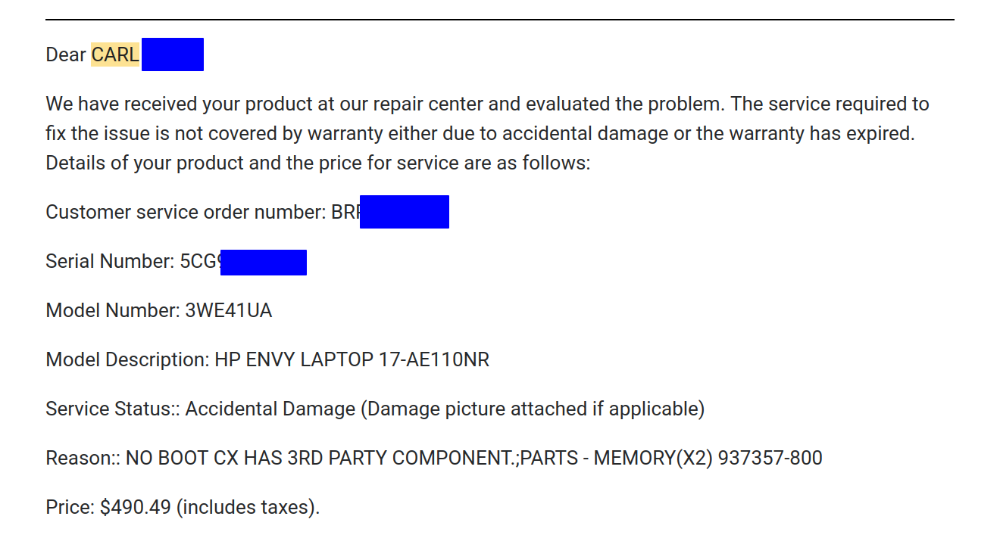

# BIOS Recovery on HP Envy 17"

Not a polished product. These are tools and notes generated while re-programming the BIOS memory chip in an HP Envy-ae110nr laptop.

It is my hope that by posting my troubleshooting process here I will help those who own a HP laptop to fix it themselves, and those who don't to save the hassle and avoid buying one in the first place.

```
+--------------------+------------------------------------------------------------+
|       Folder       |                        Description                         |
+--------------------+------------------------------------------------------------+
| extracted_firmware | Dumped binaries from SPI chip                              |
| host_pc            | C++ software that interfaces with STM32                    |
| images             | Images in readme                                           |
| recovery_usb_files | Files created by sp133161.exe and copied off the USB drive |
| resources          | Datasheets and schematics used                             |
| stm32              | Embedded firmware that interacts with BIOS chip            |
+--------------------+------------------------------------------------------------+
```


## Scenario

Several months ago my father's new laptop started having issues with the trackpad sensitivity. He called HP's tech support and was informed that they could not help him troubleshoot the problem at hand until he had updated the BIOS. The tech stepped him through downloading and running the BIOS update tool, and when the computer was rebooted my dad found that HP had indeed upgraded him from a laptop to a brick.

For whatever reason the BIOS upgrade failed, and without warning the laptop was left in a near completely inert state. The power button would light up when pressed and the system fan would spin up to maximum. That was it. No backlight, no blinking caps lock, no beeps.

After a few attempts at re-doing the BIOS flash, or booting with the *special hotkeys*, or using a [recovery USB drive](https://support.hp.com/in-en/document/ish_3932413-2337994-16#:~:text=Turn%20off%20the%20computer.,release%20the%20Windows%20%2B%20V%20keys.), the tech gave up and referred dad to the expensive warranty he had purchased along with the laptop. So the computer was packed up and mailed off for repair. 

Eventually HP got back in touch, and alongside a picture of the laptop's (existing) upgraded RAM was a message stating that the laptop's condition was the consumer's fault for changing the RAM and thus the warranty was void. HP wanted $500 to downgrade the RAM back to stock before they would continue troubleshooting.



As we've already established, the laptop's failure was not due to the 3rd party RAM, which had been cranking along perfectly for months. Under the [Magnuson-Moss Warranty Act](http://uscode.house.gov/view.xhtml?req=granuleid%3AUSC-prelim-title15-chapter50&edition=prelim) it is illegal for HP to renege on their warranty *unless the reason for warranty work is demonstrably due to the consumer's changes*. Which is a much higher burden of proof than a picture of RAM. See also "Tie in Sales Provisions" on [ftc.gov](https://www.ftc.gov/tips-advice/business-center/guidance/businesspersons-guide-federal-warranty-law). But I am not a lawyer and I sure can't afford one, so Hewlett-Packard will continue to harm consumers with impunity.

The laptop was returned un-repaired, and it sat unused for several months. Until this past weekend, when I decided it couldn't get any more bricked and asked to borrow it to continue troubleshooting. 

## Locating the BIOS chip

A quick search online led me to [schematic-x.blogspot.com](http://schematic-x.blogspot.com/2018/04/hp-schematics-pack.html) which had two PDFs claiming to be schematics for "HP Envy 17." I [downloaded one](resources/HP_ENVY_17.pdf) and thumbed through until I found the BIOS on page 34:


The IC listed there is a MX25L8005M2C-15G. There isn't one of those on this laptop, but the schematic shows that the BIOS is a SPI device, and there is a MX25L6473F SPI flash chip right next to the CPU:


Searching for that second part number brings up some hits that [include "BIOS" in them](https://www.win-raid.com/t4287f16-GUIDE-The-Beginners-Guide-to-Using-a-CH-A-SPI-Programmer-Flasher-With-Pictures-11.html). That's promising, and it makes me suspect that this schematic is for a slightly different motherboard also sold as "Envy 17".

I look at a any other likely candidate chips and search their part numbers as well. I'm not sure if this MX25L6473F is the BIOS chip or not, but it seems to be the best bet.

## Test fixture

There's a chance this process would have been much easier if I'd had a Bus Pirate and SOP8 adapter to clip onto the IC while it was still on the motherboard. FYI.

Since I don't have a way of clipping onto the IC I decide to remove it from the motherboard rather than try soldering flying wires to the pins while it's attached.


From the datasheet I know this part runs at 3 volts, which should be compatible with an STM32F103 dev board I have laying around.


I start by folding some jumper wires and soldering them to the 6 pins I need for SPI.


Then those wires are brought up to the STM32 dev board.

```
+---------------+---------------+
| SOP8 BIOS Pin |   STM32 Pin   |
+---------------+---------------+
|             1 | PA4           |
|             2 | PA6           |
|             3 | Not Connected |
|             4 | GND           |
|             5 | PA7           |
|             6 | PA5           |
|             7 | Not Connected |
|             8 | VCC           |
+---------------+---------------+
```


Finally the ST-Link is connected via SWD to the dev board, and a serial (FTDI) adapter is added. Eventually I switched out the FTDI adapter for a virtual CDC serial port on the STM's integrated micro-USB.


## Extracting the firmware

This step wasn't strictly necessary, but I want to gain familiarity with communicating to the SPI device before attempting a write, and I want the ability to read back out new firmware to confirm it was written correctly.

The first step was to read the RDID and status registers, saving the contents to a variable and inspecting in my debugger. Along the way I learned that the STM32's chip-select function isn't great, and pivoted to [manually toggling the line as a GPIO](https://stackoverflow.com/a/35790106). Once that was working I added in serial output and expanded the STM32 code to begin transferring all of the flash memory contents on boot. The SPI code was cribbed from this [digikey source file](https://www.digikey.com/en/maker/projects/getting-started-with-stm32-how-to-use-spi/09eab3dfe74c4d0391aaaa99b0a8ee17).

If the STM32 only programs successfully the first time (SWD wasn't configured):
https://www.reddit.com/r/embedded/comments/kz5ar4/error_in_initializing_stlink_device_found_on/gjorccv/

SPI reference for STM32:
https://www.digikey.com/en/maker/projects/getting-started-with-stm32-how-to-use-spi/09eab3dfe74c4d0391aaaa99b0a8ee17

The first several attempts at dumping the chip contents used either gnu-screen or [stty](https://askubuntu.com/questions/347340/how-to-dump-raw-serial-data-to-disk):

`screen /dev/ttyUSB0 115200 > output.bin`

`(stty raw; cat > output.bin) < /dev/ttyUSB0`

But I kept getting files that either didn't finish, or didn't match. I wasn't sure what was happening, but suspected either a buffer was being overrun or the FTDI serial adapter's connection was loose. See `extracted_firmware/dump_{01-05}.bin`.

Reluctantly I started working on the C++ program in `host_pc/`, and eventually also modified the stm32 firmware to [use the USB port](https://controllerstech.com/send-and-receive-data-to-pc-without-uart-stm32-usb-com/) instead of a serial adapter.

Resource used for configuring the serial port in C++: https://blog.mbedded.ninja/programming/operating-systems/linux/linux-serial-ports-using-c-cpp/.

Eventually I grew tired of hunting the source of these file differences, and wanted to know conclusively what was on that BIOS chip. So I set up the host and STM32 software to read a single byte at a time and save it to a file. This would have taken more than a day on the serial adapter, but since the USB port operates at 12MHz (USB full speed) it was only around one hour to complete. The first full firmware was dump_11.bin which matched stty-based dump_03.bin.

## Locating a new BIOS binary

Now that I had the old, supposedly corrupted BIOS file the next step would be to find a complete file to flash. I extracted the [sp133161.exe](resources/sp133161.exe) file as though it were a .zip archive, and went browsing through the resulting files. For a while it looked like the easy-to-use binary file wouldn't be had, since the HP tool only included some .efi and .s12 files, which sounds to me like the firmware is signed.

Eventually I recalled back to that recovery USB drive, and made a new one to copy the files off of. Inside (`recovery_usb_files/HP/BIOS/Current`) I found 083AD.bin and 0834D.bin. I'm not sure what the difference is, but I was able to match an instance of "083AD" ascii in the extracted firmware to the 083AD.bin file, which was as close to a conclusive match as I felt I would get. 


xxd was valuable in comparing the files with vimdiff:

`xxd 083AD.bin >083AD.hex`

## Flashing new BIOS

My first inclination for flashing the new binary file would be to bundle it with the STM32 firmware. That way no host_pc-serial issues could corrupt the transfer. Unfortunately the STM32 I have is too small to package the whole file, so I had to backtrack to sending the file from the C++ host_pc program.

Bundling binary file for C: 
https://web.archive.org/web/20140313121651/http://www.burtonini.com/blog/computers/ld-blobs-2007-07-13-15-50

Building for the STM32:

`arm-none-eabi-ld -r -b binary -o 083AD.o 083AD.bin`

Including that file in STM32cubeIDE:

Right click the project -> Properties -> C/C++ Build -> Settings -> Tool Settings tab -> MCU GCC Linker -> Miscellaneous -> Additional object files. Add the path to the arm linked 083AD.o file there.


After that approach was blocked by the microcontroller's flash storage space, the object file was re-built with regular ld and included in the host_pc program. 

After a few failed attempts to write a page-at-a-time to the STM32, I once again fell back on byte-by-byte with ack bytes being sent back. This time the entire file was written and read back out intact.

MD5 sums:

```
746d2097365c29ba0a2e90d04f627b4b  083AD.bin
746d2097365c29ba0a2e90d04f627b4b  dump_16_0x1_full_post_write_083AD.bin
```

## Conclusion

Once I was happy with the successful programming of the chip, it was removed from the test fixture and put back in the laptop. 

On first boot... Nothing happened. In fact, it took several boots, and possibly removing the hard drive before I finally saw the backlight flicker. The system then rebooted on its own, and the HP logo appeared along with a message complaining that the CMOS BIOS settings had been lost. After that everything appeared to work.


